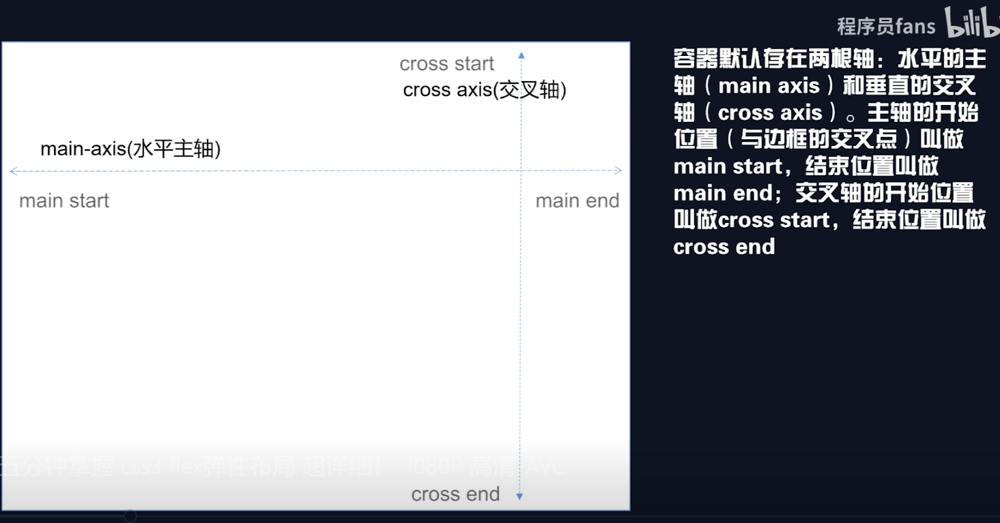

# flex

## 目录

- [概念](#概念)
  - [容器属性](#容器属性)
  - [项目属性](#项目属性)

# 概念

1. main-axis 水平主轴&#x20;
   1. main start 与边框交叉的开始位置
   2. main end  与边框交叉的结束位置
2. cross axis 交叉轴
   1. cross start  与边框交叉的开始位置
   2. cross end   与边框交叉的结束位置

## 容器属性

1. justify-content  定义游览器如何分配弹性容器主轴的空间
   1. center 居中
   2. start  开始位置对齐
   3. flex-start 开始位置对齐
   4. end 结束位置对齐
   5. flex-end 结束位置对齐
   6. left 伸缩元素一个挨一个在对齐容器得左边缘于start 类似
   7. right 元素以容器右边缘为基准，一个挨着一个对齐于end类似
   8. space-between  左右两端对齐， 中间元素间距相等
   9. space-around  中间元素间距是两端到边框间距的两倍
   10. space-evenly  中间元素间距是两端到边框的间距
2. &#x20;align-items 设置项目在其包含块中在交叉轴方向上的对齐方式。
   1. center 居中
   2. start  开始位置对齐         &#x20;
   3. flex-start 开始位置对齐
   4. end 结束位置对齐
   5. flex-end 结束位置对齐
   6. left 伸缩元素一个挨一个在对齐容器得左边缘于start 类似
   7. right 元素以容器右边缘为基准，一个挨着一个对齐于end类似
   8. self-start 和start 一样&#x20;
   9. self-end  和end一样
   10. stretch  弹性项包含外边距的交叉轴尺寸被拉升至行高
   11. `baseline`、`first baseline`、`last baseline` 文字基线
3. flex-wrap : 属性指定 flex 元素单行显示还是多行显示。如果允许换行，这个属性允许你控制行的堆叠方向。
   1. nowrap 等分容器宽度， 不换行
   2. wrap 根据自身宽度，换行 首个元素贴近上边框
   3. wrap-reverse 根据自身宽度，换行 首个元素不贴近上边框，最后一个元素贴近下边框
4. flex-direction : 指定了内部元素是如何在 flex 容器中布局的，定义了主轴的方向 (正方向或反方向)。
   1. row 主轴方向
   2. row-reverse
   3. column  交叉轴方向
   4. column-reverse
5. align-content  属性指定 flex 元素单行显示还是多行显示。如果允许换行，这个属性允许你控制行的堆叠方向
   1. flex-start 线条包装在容器的顶部。
   2. flex-end  线包装在容器的底部。
   3. center 线条挤在容器的垂直中心
   4. space-between 线条之间的间距相等
   5. space-around 线条周围以相等的间距显示
   6. stretch 拉伸线条以适合容器

## 项目属性

1. order  排列顺序：数值越小越靠前
2. align-self ：和 align-items 类似，只不过这个作用在 单个元素上
3. flex-grow : 是否平分剩余空间
   1. 0  不平分（默认）
   2. 1  平分
4. flex-shrink  :项目空间不够是否缩小
   1. 0 不缩小
   2. 1 缩小（默认）
5. flex-basis :设置项目宽度， 权重比withd高
6. flex 是3，4,5的简写
   1. flex: 0 1 auto
