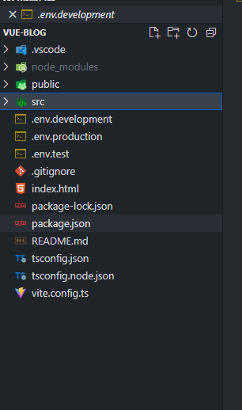

# vue 环境配置

## 目录

- [vscode 加入提示](#vscode-加入提示)
- [使用](#使用)
- [编译后使用模式](#编译后使用模式)

[ Vite Next Generation Frontend Tooling https://cn.vitejs.dev/guide/env-and-mode.html](https://cn.vitejs.dev/guide/env-and-mode.html " Vite Next Generation Frontend Tooling https://cn.vitejs.dev/guide/env-and-mode.html")



.env.development  ：开发

.env.production ：正式

.env.test :测试

文件配置

.env.production&#x20;

```vue 
# 模式
VITE_APP_ENV='production'

# base api
VITE_APP_API_BASE='/api'
```


## vscode 加入提示

```vue 
//src 目录下创建文件vite-env.d.ts

/// <reference types="vite/client" />
interface ImportMetaEnv {
    readonly VITE_APP_API_BASE: string
    // 更多环境变量...
}

```


## 使用

```vue 
//直接在 代码中这样使用
import.meta.env.VITE_APP_API_BASE
```


## 编译后使用模式

默认情况下，开发服务器 (dev 命令) 运行在 development (开发) 模式，而 build 命令则运行在 production (生产) 模式。

在某些情况下，若想在 `vite build` 时运行不同的模式来渲染不同的标题，你可以通过传递 `--mode` 选项标志来覆盖命令使用的默认模式。例如，如果你想在 staging （预发布）模式下构建应用：

```vue 
vite build --mode staging
```
