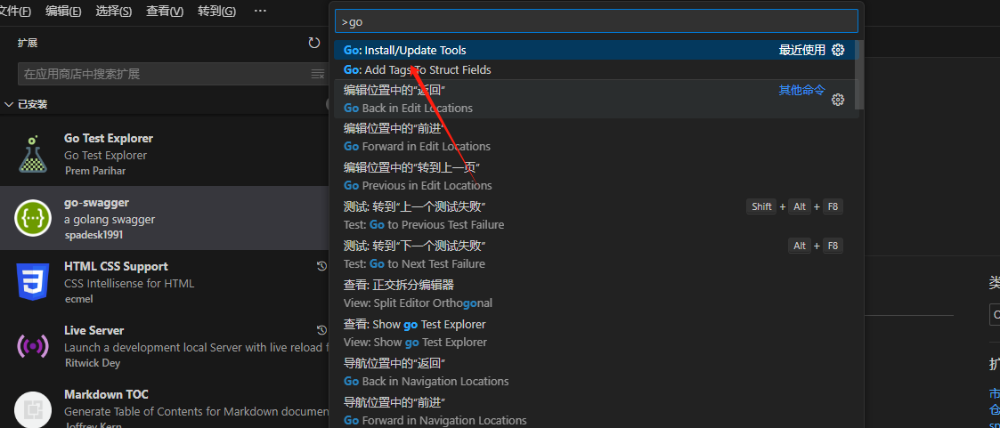
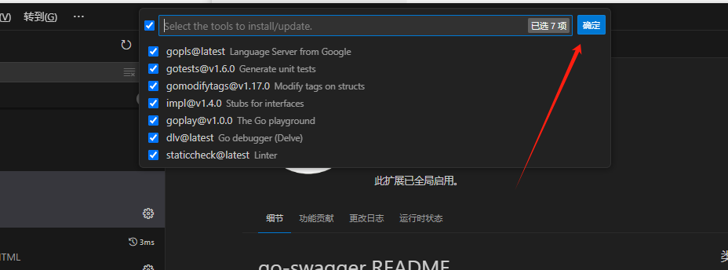
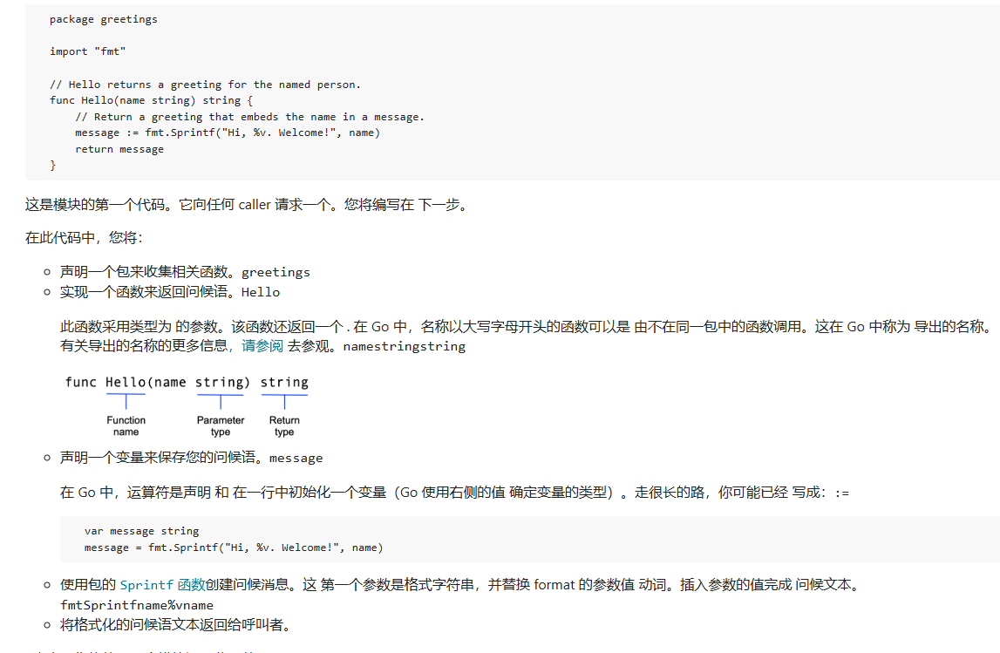

# 入门

## 目录

- [下载](#下载)
- [编辑器](#编辑器)
  - [vscode ](#vscode-)
  - [goland](#goland)
- [入门](#入门)
  - [hello world ](#hello-world-)
  - [hello 1world](#hello-1world)
- [go 模块  ](#go-模块--)
- [多模块工作区入门](#多模块工作区入门)

# 下载

[ Download and install - The Go Programming Language  https://golang.google.cn/doc/install](https://golang.google.cn/doc/install " Download and install - The Go Programming Language  https://golang.google.cn/doc/install")

# 编辑器

## vscode&#x20;

1. 安装插件: Go,Go Test Explorer,go-swagger&#x20;
2. 配置go代理

   [ Goproxy.cn The most trusted Go module proxy in China. https://goproxy.cn/](https://goproxy.cn/ " Goproxy.cn The most trusted Go module proxy in China. https://goproxy.cn/")
   ```cmake title="cmd"
   go env -w GO111MODULE=on
   go env -w GOPROXY=https://goproxy.cn,direct

   ```

3. ctrl+shift+p  输入go , 下载go相关工具链

   

   

## goland

# 入门

[ Tutorial: Get started with Go - The Go Programming Language  https://golang.google.cn/doc/tutorial/getting-started](https://golang.google.cn/doc/tutorial/getting-started " Tutorial: Get started with Go - The Go Programming Language  https://golang.google.cn/doc/tutorial/getting-started")

### hello world&#x20;

```powershell 
# 创建hello工程
go mod init hello
# 使用go run 运行
go run .  或者 go run 文件名.go

```


```go 
package main

import "fmt"

func main() {
  fmt.Println("Hello World")
}

```


### hello 1world

```go 
package main

import (
  "fmt"

  "rsc.io/quote"
)

func main() {
  fmt.Println(quote.Go())
}

```


# go 模块 &#x20;

对应代码2.1模块, 2.模块

[ Tutorial: Create a Go module - The Go Programming Language  https://golang.google.cn/doc/tutorial/create-module](https://golang.google.cn/doc/tutorial/create-module " Tutorial: Create a Go module - The Go Programming Language  https://golang.google.cn/doc/tutorial/create-module")

1. 创建模块 -- 编写一个包含可从中调用的函数的小模块 另一个模块。
   1. go mod init  [example.com/greetings](http://example.com/greetings1 "example.com/greetings")
2. [从另一个模块调用您的代码](https://golang.google.cn/doc/tutorial/call-module-code.html "从另一个模块调用您的代码")-- 导入并使用您的新模块。
   1. go mod edit -replace (包名)[=](http://example.com/greetings=../greetings "=")(到本地项目文件夹名称)
   2. go mod tidy
   3. go run .&#x20;
3. [返回并处理错误](https://golang.google.cn/doc/tutorial/handle-errors.html "返回并处理错误")-- 添加简单 错误处理。
   1. &#x20;errors.New("自定义错误")
4. [返回随机问候](https://golang.google.cn/doc/tutorial/random-greeting.html "返回随机问候")语 -- 处理数据 在切片中（Go 的动态大小的数组）。
5. [向多个人返回问候](https://golang.google.cn/doc/tutorial/greetings-multiple-people.html "向多个人返回问候")-- 在映射中存储键/值对。
6. [添加测试](https://golang.google.cn/doc/tutorial/add-a-test.html "添加测试")-- 使用 Go 的内置单元测试 功能来测试您的代码。
   1. go test  返回全部测试
   2. go test -v 返回每个函数的
7. [编译并安装应用程序](https://golang.google.cn/doc/tutorial/compile-install.html "编译并安装应用程序")-- 在本地编译和安装您的代码。
   1. go build

Go 代码被分组到包中，而包被分组到模块中。你 module 指定运行代码所需的依赖项，包括 Go version 及其所需的其他模块集



# 多模块工作区入门
