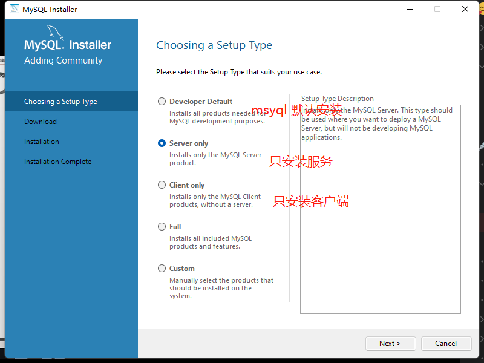
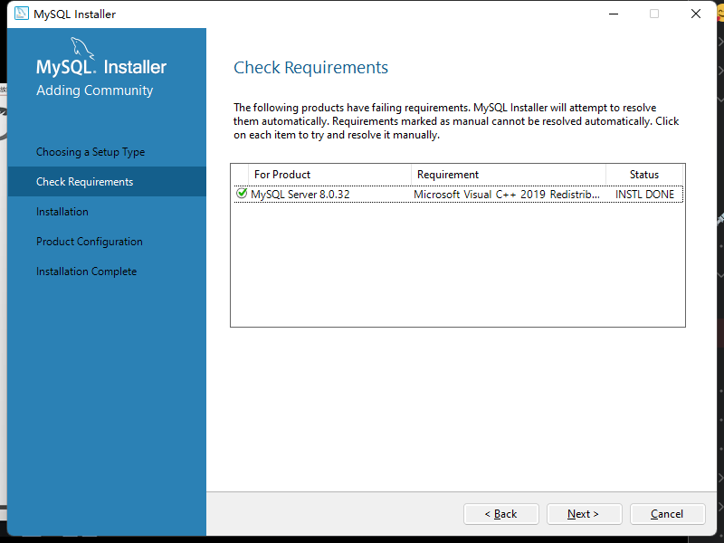
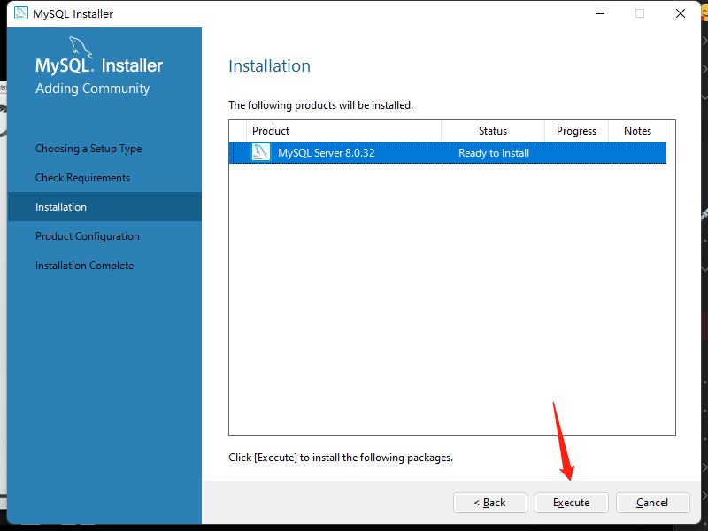

# mysql 初步安装

## 目录

- [windows初步安装](#windows初步安装)
- [docker 安装mysql](#docker-安装mysql)

> 社区版本

## windows初步安装

[   https://dev.mysql.com/downloads/file/?id=516927](https://dev.mysql.com/downloads/file/?id=516927 "   https://dev.mysql.com/downloads/file/?id=516927")

选择安装的服务



安装相应依赖





## docker 安装mysql

```bash 
# 创建数据卷
docker volume create mysql

docker run -itd --name mysql -p 3306:3306 \
-e MYSQL_ROOT_PASSWORD=123456 \
-v mysql:/var/lib/mysql \
mysql:latest

```


```sql 
# 创建用户
create user 'sa'@'%' identified by '123456';

# 授予所有数据库表的权限给用户
grant all on *.* to 'sa'@'%';

```
