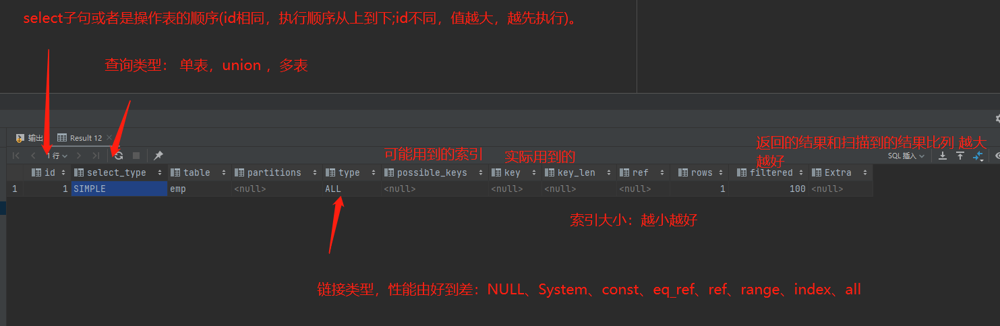

# sql优化

## 目录

- [查看数据库执行频率](#查看数据库执行频率)
- [慢查询日志](#慢查询日志)
- [性能分析](#性能分析)
  - [profiling](#profiling)
  - [explain执行计划](#explain执行计划)
- [索引失效场景](#索引失效场景)
- [注意](#注意)
  - [分页查询limit语句](#分页查询limit语句)

# 查看数据库执行频率

```sql 
show global status like 'com_______';

```


# 慢查询日志

> 慢查询日志记录了所有执行时间超过指定参数（long\_query\_time ,单位秒，默认10秒）的所有sql语句的日志
> mysql 慢查询 日志默认是没有开启， 需要在mysql 的配置文件（/etc/my.cnf）

```sql 
# 开启mysql 慢日志查询
show_query_log=1

# 设置慢日志时间
log_query_time=2

```


配置完毕后， 重新启动mysql服务器，查看慢日志：/var/lib/mysql/localhost-show\.log

# 性能分析

## profiling

```sql 
# 查看是否支持
select @@have_profiling;

# mysql profiling默认关闭
# 查看是否开启profiling
select @@profiling;

# 开启
set profiling=1;

# 查看每一条sql耗时的基本情况
show profiles;

# 查看指定query_id的sql语句各个阶段的耗时情况
show profile [cpu] for query query_id;


```


## explain执行计划

> 查看执行计划 直接在sql命令前加上explain 或者desc 命令

```sql 
explain select * from 表 where 条件
```




# 索引失效场景

1. 最左前缀法则： 如果索引是联合索引，则要遵循最左前缀法则从最左列开始，并且不跳过索引中的列，如果跳跃某一列，索引将部分失效。&#x20;
2. 不要在索引列上进行运算操作
3. 字符串不加单引号 会导致索引失效
4. 头部模糊查询会导致索引失效
5. or 链接条件，一侧有索引一侧无索引，会导致索引失效

# 注意

1. 下面这个该怎样进行优化

```sql 
select id ,username,pwd from user where username='test';

```


&#x20;优化方案：&#x20;

1. 增加username索引： 但是会有回表查询
2. 增加username ,pwd 联合索引： 这样不会回表查询

### 分页查询limit语句

> 列表第一个重点： 排序
> 有了排序后 ， 我们上一页和下一也就可以用到排序的字段来进行条件判断并分页

1. 加入组合索引
2. 更改分页逻辑
