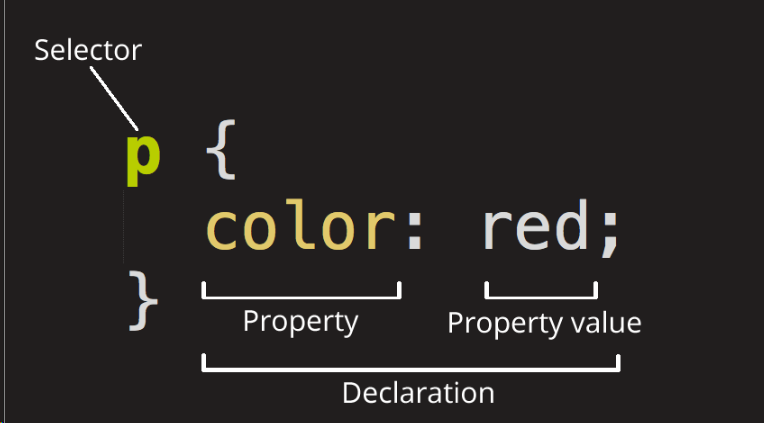
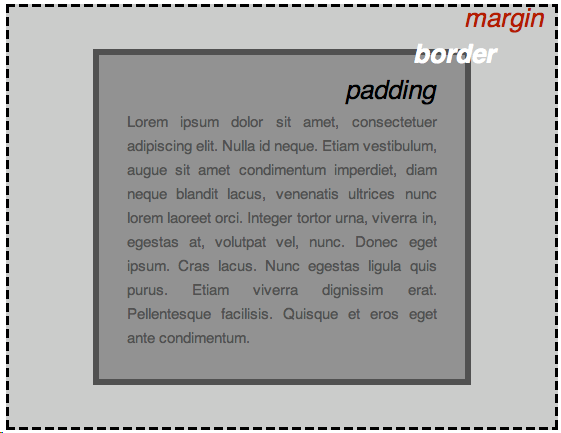

# css

## 目录

- [什么是css](#什么是css)
- [选择器](#选择器)
- [属性选择器](#属性选择器)
- [子字符选择器](#子字符选择器)
- [伪类伪元素](#伪类伪元素)
  - [伪类](#伪类)
  - [伪元素](#伪元素)
- [关系选择器](#关系选择器)
- [CSS：一切皆盒子](#CSS一切皆盒子)
- [层叠和继承](#层叠和继承)
  - [优先级： ](#优先级-)
  - [继承](#继承)

[flex](flex/flex.md "flex")

## 什么是css

> 引用css

```html 
也就是 <head> 和 </head> 标签之间
<link href="styles/style.css" rel="stylesheet" />
```


和 HTML 类似，CSS 也不是真正的编程语言，甚至不是标记语言。**CSS 是一门样式表语言**，这也就是说人们可以用它来选择性地为 HTML 元素添加样式。



[选择器（Selector）](https://developer.mozilla.org/zh-CN/docs/Learn/Getting_started_with_the_web/CSS_basics#选择器（selector） "选择器（Selector）")

HTML 元素的名称位于规则集开始。它选择了一个或多个需要添加样式的元素（在这个例子中就是 [\<p>](https://developer.mozilla.org/zh-CN/docs/Web/HTML/Element/p "<p>") 元素）。要给不同元素添加样式，只需要更改选择器。

[声明（Declaration）](https://developer.mozilla.org/zh-CN/docs/Learn/Getting_started_with_the_web/CSS_basics#声明（declaration） "声明（Declaration）")

一个单独的规则，如 `color: red;` 用来指定添加样式元素的**属性**。

[属性（Properties）](https://developer.mozilla.org/zh-CN/docs/Learn/Getting_started_with_the_web/CSS_basics#属性（properties） "属性（Properties）")

改变 HTML 元素样式的途径（本例中 `color` 就是 [\<p>](https://developer.mozilla.org/zh-CN/docs/Web/HTML/Element/p "<p>") 元素的属性）。CSS 中，由编写人员决定修改哪个属性以改变规则。

[属性的值（Property value）](https://developer.mozilla.org/zh-CN/docs/Learn/Getting_started_with_the_web/CSS_basics#属性的值（property_value） "属性的值（Property value）")

在属性的右边，冒号后面即**属性的值**，它从指定属性的众多外观中选择一个值（我们除了 `red` 之外还有很多属性值可以用于 `color` ）。

注意其他重要的语法：

- 除了选择器部分，每个规则集都应该包含在成对的大括号里（`{}`）。
- 在每个声明里要用冒号（`:`）将属性与属性值分隔开。
- 在每个规则集里要用分号（`;`）将各个声明分隔开。

选择多个用逗号分开

## 选择器

| 选择器名称              | 选择的内容                                              | 示例                                                            |
| ------------------ | -------------------------------------------------- | ------------------------------------------------------------- |
| 元素选择器（也称作标签或类型选择器） | 所有指定类型的 HTML 元素                                    | `p`选择 `<p>`                                                   |
| ID 选择器             | 具有特定 ID 的元素。单一 HTML 页面中，每个 ID 只对应一个元素，一个元素只对应一个 ID | `#my-id`选择 `<p id="my-id">` 或 `<a id="my-id">`                |
| 类选择器               | 具有特定类的元素。单一页面中，一个类可以有多个实例                          | `.my-class`选择 `<p class="my-class">` 和 `<a class="my-class">` |
| 属性选择器              | 拥有特定属性的元素                                          | `img[src]`选择 `` 但不是 ``            |
| 伪类选择器              | 特定状态下的特定元素（比如鼠标指针悬停于链接之上）                          | `a:hover`选择仅在鼠标指针悬停在链接上时的 `<a>` 元素                            |

## 属性选择器

| 选择器                  | 示例                              | 描述                                                                                                                     |
| -------------------- | ------------------------------- | ---------------------------------------------------------------------------------------------------------------------- |
| `[_attr_]`           | `a[title]`                      | 匹配带有一个名为\_attr\_的属性的元素——方括号里的值。                                                                                        |
| `[_attr_=_value_]`   | `a[href="https://example.com"]` | 匹配带有一个名为\_attr\_的属性的元素，其值正为\_value\_——引号中的字符串。                                                                         |
| `[_attr_~=_value_]`  | `p[class~="special"]`           | 匹配带有一个名为\_attr\_的属性的元素，其值正为\_value\_，或者匹配带有一个\_attr\_属性的元素，其值有一个或者更多，至少有一个和\_value\_匹配。&#xA;&#xA;注意，在一列中的好几个值，是用空格隔开的。 |
| `[_attr_\|=_value_]` | `div[lang\|="zh"]`              | 匹配带有一个名为\_attr\_的属性的元素，其值可正为\_value\_，或者开始为\_value\_，后面紧随着一个连字符。                                                       |

## 子字符选择器

| 选择器             | 示例                  | 描述                                                        |
| --------------- | ------------------- | --------------------------------------------------------- |
| `[attr^=value]` | `li[class^="box-"]` | 匹配带有一个名为\_attr\_的属性的元素，其值开头为\_value\_子字符串。                |
| `[attr$=value]` | `li[class$="-box"]` | 匹配带有一个名为\_attr\_的属性的元素，其值结尾为\_value\_子字符串                 |
| `[attr*=value]` | `li[class*="box"]`  | 匹配带有一个名为\_attr\_的属性的元素，其值的字符串中的任何地方，至少出现了一次\_value\_子字符串。 |

## 伪类伪元素

伪类就是开头为冒号的关键字：  :pseudo-class-name

伪元素开头为双冒号`::`  ::pseudo-element-name

### 伪类

| 选择器                                                                                                                                                                          | 描述                                                                                                                                                                                                     |
| ---------------------------------------------------------------------------------------------------------------------------------------------------------------------------- | ------------------------------------------------------------------------------------------------------------------------------------------------------------------------------------------------------ |
| [:active](https://developer.mozilla.org/zh-CN/docs/Web/CSS/:active ":active")                                                                                                | 在用户激活（例如点击）元素的时候匹配。                                                                                                                                                                                    |
| [:any-link](https://developer.mozilla.org/zh-CN/docs/Web/CSS/:any-link ":any-link")                                                                                          | 匹配一个链接的`:link`和`:visited`状态。                                                                                                                                                                           |
| [:blank](https://developer.mozilla.org/zh-CN/docs/Web/CSS/:blank ":blank")                                                                                                   | 匹配空输入值的[\<input>](https://developer.mozilla.org/zh-CN/docs/Web/HTML/Element/input "<input>")[元素](https://developer.mozilla.org/zh-CN/docs/Web/HTML/Element/input "元素")。                                |
| [:checked](https://developer.mozilla.org/zh-CN/docs/Web/CSS/:checked ":checked")                                                                                             | 匹配处于选中状态的单选或者复选框。                                                                                                                                                                                      |
| [:current](https://developer.mozilla.org/en-US/docs/Web/CSS/:current ":current")[ (en-US)](https://developer.mozilla.org/en-US/docs/Web/CSS/:current " (en-US)")             | 匹配正在展示的元素，或者其上级元素。                                                                                                                                                                                     |
| [:default](https://developer.mozilla.org/zh-CN/docs/Web/CSS/:default ":default")                                                                                             | 匹配一组相似的元素中默认的一个或者更多的 UI 元素。                                                                                                                                                                            |
| [:dir](https://developer.mozilla.org/zh-CN/docs/Web/CSS/:dir ":dir")                                                                                                         | 基于其方向性（HTML[dir](https://developer.mozilla.org/zh-CN/docs/Web/HTML/Global_attributes/dir "dir")属性或者 CSS[direction](https://developer.mozilla.org/zh-CN/docs/Web/CSS/direction "direction")属性的值）匹配一个元素。 |
| [:disabled](https://developer.mozilla.org/zh-CN/docs/Web/CSS/:disabled ":disabled")                                                                                          | 匹配处于关闭状态的用户界面元素                                                                                                                                                                                        |
| [:empty](https://developer.mozilla.org/zh-CN/docs/Web/CSS/:empty ":empty")                                                                                                   | 匹配除了可能存在的空格外，没有子元素的元素。                                                                                                                                                                                 |
| [:enabled](https://developer.mozilla.org/zh-CN/docs/Web/CSS/:enabled ":enabled")                                                                                             | 匹配处于开启状态的用户界面元素。                                                                                                                                                                                       |
| [:first](https://developer.mozilla.org/zh-CN/docs/Web/CSS/:first ":first")                                                                                                   | 匹配[分页媒体](https://developer.mozilla.org/zh-CN/docs/Web/CSS/CSS_paged_media "分页媒体")的第一页。                                                                                                                 |
| [:first-child](https://developer.mozilla.org/zh-CN/docs/Web/CSS/:first-child ":first-child")                                                                                 | 匹配兄弟元素中的第一个元素。                                                                                                                                                                                         |
| [:first-of-type](https://developer.mozilla.org/zh-CN/docs/Web/CSS/:first-of-type ":first-of-type")                                                                           | 匹配兄弟元素中第一个某种类型的元素。                                                                                                                                                                                     |
| [:focus](https://developer.mozilla.org/zh-CN/docs/Web/CSS/:focus ":focus")                                                                                                   | 当一个元素有焦点的时候匹配。                                                                                                                                                                                         |
| [:focus-visible](https://developer.mozilla.org/zh-CN/docs/Web/CSS/:focus-visible ":focus-visible")                                                                           | 当元素有焦点，且焦点对用户可见的时候匹配。                                                                                                                                                                                  |
| [:focus-within](https://developer.mozilla.org/zh-CN/docs/Web/CSS/:focus-within ":focus-within")                                                                              | 匹配有焦点的元素，以及子代元素有焦点的元素。                                                                                                                                                                                 |
| [:future](https://developer.mozilla.org/en-US/docs/Web/CSS/:future ":future")[ (en-US)](https://developer.mozilla.org/en-US/docs/Web/CSS/:future " (en-US)")                 | 匹配当前元素之后的元素。                                                                                                                                                                                           |
| [:hover](https://developer.mozilla.org/zh-CN/docs/Web/CSS/:hover ":hover")                                                                                                   | 当用户悬浮到一个元素之上的时候匹配。                                                                                                                                                                                     |
| [:indeterminate](https://developer.mozilla.org/zh-CN/docs/Web/CSS/:indeterminate ":indeterminate")                                                                           | 匹配未定态值的 UI 元素，通常为[复选框](https://developer.mozilla.org/zh-CN/docs/Web/HTML/Element/input/checkbox "复选框")。                                                                                                |
| [:in-range](https://developer.mozilla.org/zh-CN/docs/Web/CSS/:in-range ":in-range")                                                                                          | 用一个区间匹配元素，当值处于区间之内时匹配。                                                                                                                                                                                 |
| [:invalid](https://developer.mozilla.org/zh-CN/docs/Web/CSS/:invalid ":invalid")                                                                                             | 匹配诸如`<input>`的位于不可用状态的元素。                                                                                                                                                                              |
| [:lang](https://developer.mozilla.org/zh-CN/docs/Web/CSS/:lang ":lang")                                                                                                      | 基于语言（HTML[lang](https://developer.mozilla.org/zh-CN/docs/Web/HTML/Global_attributes/lang "lang")属性的值）匹配元素。                                                                                             |
| [:last-child](https://developer.mozilla.org/zh-CN/docs/Web/CSS/:last-child ":last-child")                                                                                    | 匹配兄弟元素中最末的那个元素。                                                                                                                                                                                        |
| [:last-of-type](https://developer.mozilla.org/zh-CN/docs/Web/CSS/:last-of-type ":last-of-type")                                                                              | 匹配兄弟元素中最后一个某种类型的元素。                                                                                                                                                                                    |
| [:left](https://developer.mozilla.org/zh-CN/docs/Web/CSS/:left ":left")                                                                                                      | 在[分页媒体](https://developer.mozilla.org/zh-CN/docs/Web/CSS/CSS_paged_media "分页媒体")中，匹配左手边的页。                                                                                                             |
| [:link](https://developer.mozilla.org/zh-CN/docs/Web/CSS/:link ":link")                                                                                                      | 匹配未曾访问的链接。                                                                                                                                                                                             |
| [:local-link](https://developer.mozilla.org/en-US/docs/Web/CSS/:local-link ":local-link")[ (en-US)](https://developer.mozilla.org/en-US/docs/Web/CSS/:local-link " (en-US)") | 匹配指向和当前文档同一网站页面的链接。                                                                                                                                                                                    |
| [:is()](https://developer.mozilla.org/zh-CN/docs/Web/CSS/:is ":is()")                                                                                                        | 匹配传入的选择器列表中的任何选择器。                                                                                                                                                                                     |
| [:not](https://developer.mozilla.org/zh-CN/docs/Web/CSS/:not ":not")                                                                                                         | 匹配作为值传入自身的选择器未匹配的物件。                                                                                                                                                                                   |
| [:nth-child](https://developer.mozilla.org/zh-CN/docs/Web/CSS/:nth-child ":nth-child")                                                                                       | 匹配一列兄弟元素中的元素——兄弟元素按照\_an+b\_形式的式子进行匹配（比如 2n+1 匹配元素 1、3、5、7 等。即所有的奇数个）。                                                                                                                                 |
| [:nth-of-type](https://developer.mozilla.org/zh-CN/docs/Web/CSS/:nth-of-type ":nth-of-type")                                                                                 | 匹配某种类型的一列兄弟元素（比如，`<p>`元素）——兄弟元素按照\_an+b\_形式的式子进行匹配（比如 2n+1 匹配元素 1、3、5、7 等。即所有的奇数个）。                                                                                                                    |
| [:nth-last-child](https://developer.mozilla.org/zh-CN/docs/Web/CSS/:nth-last-child ":nth-last-child")                                                                        | 匹配一列兄弟元素，从后往前倒数。兄弟元素按照\_an+b\_形式的式子进行匹配（比如 2n+1 匹配按照顺序来的最后一个元素，然后往前两个，再往前两个，诸如此类。从后往前数的所有奇数个）。                                                                                                         |
| [:nth-last-of-type](https://developer.mozilla.org/zh-CN/docs/Web/CSS/:nth-last-of-type ":nth-last-of-type")                                                                  | 匹配某种类型的一列兄弟元素（比如，`<p>`元素），从后往前倒数。兄弟元素按照\_an+b\_形式的式子进行匹配（比如 2n+1 匹配按照顺序来的最后一个元素，然后往前两个，再往前两个，诸如此类。从后往前数的所有奇数个）。                                                                                        |
| [:only-child](https://developer.mozilla.org/zh-CN/docs/Web/CSS/:only-child ":only-child")                                                                                    | 匹配没有兄弟元素的元素。                                                                                                                                                                                           |
| [:only-of-type](https://developer.mozilla.org/zh-CN/docs/Web/CSS/:only-of-type ":only-of-type")                                                                              | 匹配兄弟元素中某类型仅有的元素。                                                                                                                                                                                       |
| [:optional](https://developer.mozilla.org/zh-CN/docs/Web/CSS/:optional ":optional")                                                                                          | 匹配不是必填的 form 元素。                                                                                                                                                                                       |
| [:out-of-range](https://developer.mozilla.org/zh-CN/docs/Web/CSS/:out-of-range ":out-of-range")                                                                              | 按区间匹配元素，当值不在区间内的的时候匹配。                                                                                                                                                                                 |
| [:past](https://developer.mozilla.org/en-US/docs/Web/CSS/:past ":past")[ (en-US)](https://developer.mozilla.org/en-US/docs/Web/CSS/:past " (en-US)")                         | 匹配当前元素之前的元素。                                                                                                                                                                                           |
| [:placeholder-shown](https://developer.mozilla.org/zh-CN/docs/Web/CSS/:placeholder-shown ":placeholder-shown")                                                               | 匹配显示占位文字的 input 元素。                                                                                                                                                                                    |
| [:playing](https://developer.mozilla.org/zh-CN/docs/Web/CSS/:playing ":playing")                                                                                             | 匹配代表音频、视频或者相似的能“播放”或者“暂停”的资源的，且正在“播放”的元素。                                                                                                                                                              |
| [:paused](https://developer.mozilla.org/zh-CN/docs/Web/CSS/:paused ":paused")                                                                                                | 匹配代表音频、视频或者相似的能“播放”或者“暂停”的资源的，且正在“暂停”的元素。                                                                                                                                                              |
| [:read-only](https://developer.mozilla.org/zh-CN/docs/Web/CSS/:read-only ":read-only")                                                                                       | 匹配用户不可更改的元素。                                                                                                                                                                                           |
| [:read-write](https://developer.mozilla.org/zh-CN/docs/Web/CSS/:read-write ":read-write")                                                                                    | 匹配用户可更改的元素。                                                                                                                                                                                            |
| [:required](https://developer.mozilla.org/zh-CN/docs/Web/CSS/:required ":required")                                                                                          | 匹配必填的 form 元素。                                                                                                                                                                                         |
| [:right](https://developer.mozilla.org/zh-CN/docs/Web/CSS/:right ":right")                                                                                                   | 在[分页媒体](https://developer.mozilla.org/zh-CN/docs/Web/CSS/CSS_paged_media "分页媒体")中，匹配右手边的页。                                                                                                             |
| [:root](https://developer.mozilla.org/zh-CN/docs/Web/CSS/:root ":root")                                                                                                      | 匹配文档的根元素。                                                                                                                                                                                              |
| [:scope](https://developer.mozilla.org/zh-CN/docs/Web/CSS/:scope ":scope")                                                                                                   | 匹配任何为参考点元素的的元素。                                                                                                                                                                                        |
| [:valid](https://developer.mozilla.org/zh-CN/docs/Web/CSS/:valid ":valid")                                                                                                   | 匹配诸如`<input>`元素的处于可用状态的元素。                                                                                                                                                                             |
| [:target](https://developer.mozilla.org/zh-CN/docs/Web/CSS/:target ":target")                                                                                                | 匹配当前 URL 目标的元素（例如如果它有一个匹配当前[URL 分段](https://en.wikipedia.org/wiki/Fragment_identifier "URL 分段")的元素）。                                                                                                   |
| [:visited](https://developer.mozilla.org/zh-CN/docs/Web/CSS/:visited ":visited")                                                                                             | 匹配已访问链接。                                                                                                                                                                                               |
| :where                                                                                                                                                                       | 条件                                                                                                                                                                                                     |

### [伪元素](https://developer.mozilla.org/zh-CN/docs/Learn/CSS/Building_blocks/Selectors/Pseudo-classes_and_pseudo-elements#伪元素 "伪元素")

| 选择器                                                                                                      | 描述                         |
| -------------------------------------------------------------------------------------------------------- | -------------------------- |
| [::after](https://developer.mozilla.org/zh-CN/docs/Web/CSS/::after "::after")                            | 匹配出现在原有元素的实际内容之后的一个可样式化元素。 |
| [::before](https://developer.mozilla.org/zh-CN/docs/Web/CSS/::before "::before")                         | 匹配出现在原有元素的实际内容之前的一个可样式化元素。 |
| [::first-letter](https://developer.mozilla.org/zh-CN/docs/Web/CSS/::first-letter "::first-letter")       | 匹配元素的第一个字母。                |
| [::first-line](https://developer.mozilla.org/zh-CN/docs/Web/CSS/::first-line "::first-line")             | 匹配包含此伪元素的元素的第一行。           |
| [::grammar-error](https://developer.mozilla.org/zh-CN/docs/Web/CSS/::grammar-error "::grammar-error")    | 匹配文档中包含了浏览器标记的语法错误的那部分。    |
| [::selection](https://developer.mozilla.org/zh-CN/docs/Web/CSS/::selection "::selection")                | 匹配文档中被选择的那部分。              |
| [::spelling-error](https://developer.mozilla.org/zh-CN/docs/Web/CSS/::spelling-error "::spelling-error") | 匹配文档中包含了浏览器标记的拼写错误的那部分。    |

## 关系选择器

| 选择器                | 描述                                    |
| ------------------ | ------------------------------------- |
| 空格（" "）字符——组合两个选择器 | body article p   后代选择器                |
| article > p        | 子代关系选择器是个大于号（>），只会在选择器选中直接子元素的时候匹配    |
| p + img            | 邻接兄弟选择器（+）用来选中恰好处于另一个在继承关系上同级的元素旁边的物件 |
| p \~ img           | 通用兄弟， 选中一个元素的兄弟元素，即使它们不直接相邻           |

## [CSS：一切皆盒子](https://developer.mozilla.org/zh-CN/docs/Learn/Getting_started_with_the_web/CSS_basics#css：一切皆盒子 "CSS：一切皆盒子")

编写 CSS 时你会发现，你的工作好像是围绕着一个一个盒子展开的——设置尺寸、颜色、位置，等等。页面里大部分 HTML 元素都可以被看作若干层叠的盒子。



- `padding`（内边距）：是指内容周围的空间。在下面的例子中，它是段落文本周围的空间。
- `border`（边框）：是紧接着内边距的线。
- `margin`（外边距）：是围绕元素边界外侧的空间。

# 层叠和继承

## 优先级：&#x20;

> 上到下， 先具体后大概
> 想同权重，则是后面的应用
> !importer 最高优先级

## 继承

[inherit](https://developer.mozilla.org/zh-CN/docs/Web/CSS/inherit "inherit")设置该属性会使子元素属性和父元素相同。实际上，就是“开启继承”。

[initial](https://developer.mozilla.org/zh-CN/docs/Web/CSS/initial "initial")将应用于选定元素的属性值设置为该属性的[初始值](https://developer.mozilla.org/zh-CN/docs/Web/CSS/initial_value "初始值")。

[revert](https://developer.mozilla.org/en-US/docs/Web/CSS/revert "revert")[ (en-US)](https://developer.mozilla.org/en-US/docs/Web/CSS/revert " (en-US)")将应用于选定元素的属性值重置为浏览器的默认样式，而不是应用于该属性的默认值。在许多情况下，此值的作用类似于 [unset](https://developer.mozilla.org/zh-CN/docs/Web/CSS/unset "unset")。

[revert-layer](https://developer.mozilla.org/en-US/docs/Web/CSS/revert-layer "revert-layer")[ (en-US)](https://developer.mozilla.org/en-US/docs/Web/CSS/revert-layer " (en-US)")将应用于选定元素的属性值重置为在上一个[层叠层](https://developer.mozilla.org/zh-CN/docs/Web/CSS/@layer "层叠层")中建立的值。

[unset](https://developer.mozilla.org/zh-CN/docs/Web/CSS/unset "unset")将属性重置为自然值，也就是如果属性是自然继承那么就是 `inherit`，否则和 `initial` 一样
