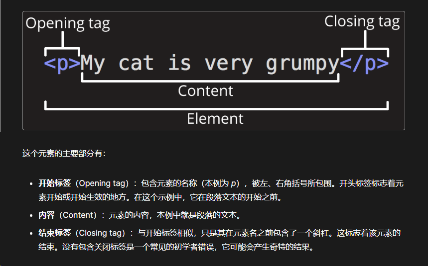
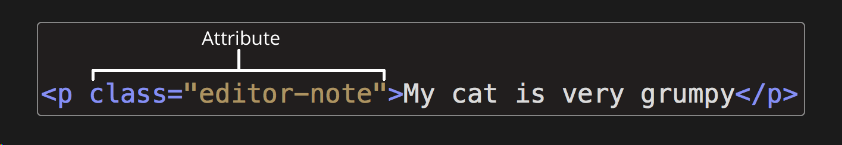
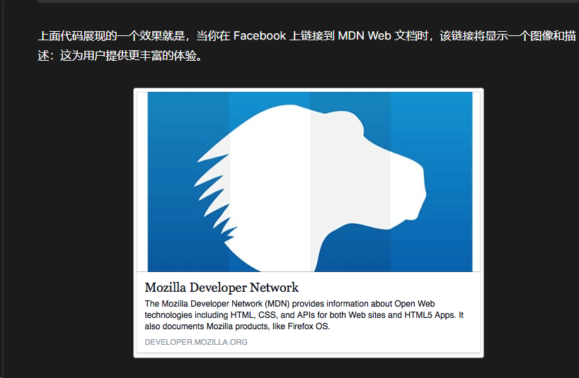
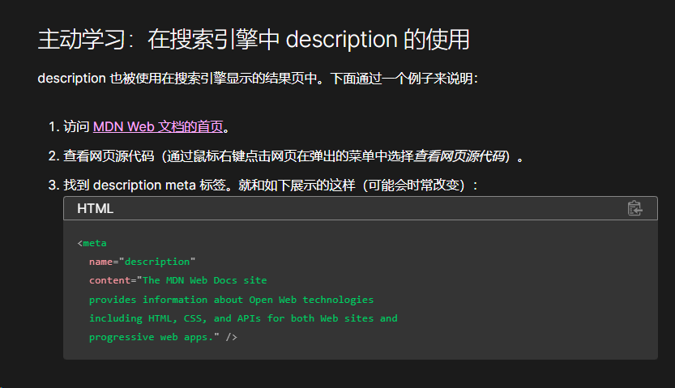

# html

## 目录

- [html 元素](#html-元素)
- [剖析 HTML 文档](#剖析-HTML-文档)
- [块级元素和内联元素](#块级元素和内联元素)
  - [块级元素](#块级元素)
  - [内联元素](#内联元素)
  - [空元素](#空元素)
- [html 头元信息](#html-头元信息)
  - [设置语言](#设置语言)
  - [显示字符集](#显示字符集)
  - [显示图标](#显示图标)
  - [其他类型元数据](#其他类型元数据)
  - [seo](#seo)
  - [引入css 和js](#引入css-和js)
- [注意点](#注意点)

[元素](元素/元素.md "元素")

[HTML](https://developer.mozilla.org/zh-CN/docs/Glossary/HTML "HTML")（HyperText Markup Language，超文本标记语言）是一种用来告知浏览器如何组织页面的\_标记语言\_。HTML 可复杂、可简单，一切取决于 web 开发者。HTML 由一系列的[元素](https://developer.mozilla.org/zh-CN/docs/Glossary/Element "元素")组成，这些元素可以用来包围或\_标记\_不同部分的内容，使其以某种方式呈现或者工作。两端的[标签](https://developer.mozilla.org/zh-CN/docs/Glossary/Tag "标签")可以使内容变成超链接，以连接到另一个页面；使字体表现为斜体等。

## html 元素





## [剖析 HTML 文档](https://developer.mozilla.org/zh-CN/docs/Learn/HTML/Introduction_to_HTML/Getting_started#剖析_html_文档 "剖析 HTML 文档")

```vue 
<!doctype html>
<html lang="zh-CN">
  <head>
    <meta charset="utf-8" />
    <title>我的测试站点</title>
  </head>
  <body>
    <p>这是我的页面</p>
  </body>
</html>

```


1. `<!DOCTYPE html>`: 声明文档类型。早期的 HTML（大约 1991-1992 年）文档类型声明类似于链接，规定了 HTML 页面必须遵从的良好规则，能自动检测错误和其他有用的东西。文档类型使用类似于这样：

   HTMLCopy to Clipboard

   \<!DOCTYPE html PUBLIC "-//W3C//DTD XHTML 1.0 Transitional//EN" "[http://www.w3.org/TR/xhtml1/DTD/xhtml1-transitional.dtd](http://www.w3.org/TR/xhtml1/DTD/xhtml1-transitional.dtd "http://www.w3.org/TR/xhtml1/DTD/xhtml1-transitional.dtd")">

   文档类型是一个历史遗留问题，需要包含它才能使其他东西正常工作。现在，只需要知道 `<!DOCTYPE html>` 是最短的有效文档声明！
2. `<html></html>`: [\<html>](https://developer.mozilla.org/zh-CN/docs/Web/HTML/Element/html "<html>") 元素。这个元素包裹了页面中所有的内容，有时被称为根元素。
3. `<head></head>`: [\<head>](https://developer.mozilla.org/zh-CN/docs/Web/HTML/Element/head "<head>") 元素。这个元素是一个容器，它包含了所有你想包含在 HTML 页面中但**不在 HTML 页面中显示**的内容。这些内容包括你想在搜索结果中出现的关键字和页面描述、CSS 样式、字符集声明等等。以后的章节中会学到更多相关的内容。
4. `<meta charset="utf-8">`: [\<meta>](https://developer.mozilla.org/zh-CN/docs/Web/HTML/Element/meta "<meta>") 元素。这个元素代表了不能由其他 HTML 元相关元素表示的元数据，比如 [\<base>](https://developer.mozilla.org/zh-CN/docs/Web/HTML/Element/base "<base>")、[\<link>](https://developer.mozilla.org/zh-CN/docs/Web/HTML/Element/link "<link>")、[\<script>](https://developer.mozilla.org/zh-CN/docs/Web/HTML/Element/script "<script>")、[\<style>](https://developer.mozilla.org/zh-CN/docs/Web/HTML/Element/style "<style>") 或 [\<title>](https://developer.mozilla.org/zh-CN/docs/Web/HTML/Element/title "<title>")。[charset](https://developer.mozilla.org/zh-CN/docs/Web/HTML/Element/meta#charset "charset") 属性将你的文档的字符集设置为 UTF-8，其中包括绝大多数人类书面语言的大多数字符。有了这个设置，页面现在可以处理它可能包含的任何文本内容。没有理由不对它进行设置，它可以帮助避免以后的一些问题。
5. `<title></title>`: [\<title>](https://developer.mozilla.org/zh-CN/docs/Web/HTML/Element/title "<title>") 元素。这设置了页面的标题，也就是出现在该页面加载的浏览器标签中的内容。当页面被加入书签时，页面标题也被用来描述该页面。
6. `<body></body>`: [\<body>](https://developer.mozilla.org/zh-CN/docs/Web/HTML/Element/body "<body>") 元素。包含了你访问页面时\_所有\_显示在页面上的内容，包含文本、图片、视频、游戏、可播放音频轨道等等。
7.

## [块级元素和内联元素](https://developer.mozilla.org/zh-CN/docs/Learn/HTML/Introduction_to_HTML/Getting_started#块级元素和内联元素 "块级元素和内联元素")

在 HTML 中有两种你需要知道的重要元素类别，块级元素和内联元素。

- 块级元素在页面中以块的形式展现。一个块级元素出现在它前面的内容之后的新行上。任何跟在块级元素后面的内容也会出现在新的行上。块级元素通常是页面上的结构元素。例如，一个块级元素可能代表标题、段落、列表、导航菜单或页脚。一个块级元素不会嵌套在一个内联元素里面，但它可能嵌套在另一个块级元素里面。
- 内联元素通常出现在块级元素中并环绕文档内容的一小部分，而不是一整个段落或者一组内容。内联元素不会导致文本换行。它通常与文本一起使用，例如，[\<a>](https://developer.mozilla.org/zh-CN/docs/Web/HTML/Element/a "<a>") 元素创建一个超链接，[\<em>](https://developer.mozilla.org/zh-CN/docs/Web/HTML/Element/em "<em>") 和 [\<strong>](https://developer.mozilla.org/zh-CN/docs/Web/HTML/Element/strong "<strong>") 等元素创建强调。
- 空元素，不是所有元素都拥有开始标签、内容和结束标签。一些元素只有一个标签，通常用来在此元素所在位置插入/嵌入一些东西。这些元素被称为[空元素](https://developer.mozilla.org/zh-CN/docs/Glossary/Void_element "空元素")。例如：元素 [\](https://developer.mozilla.org/zh-CN/docs/Web/HTML/Element/img "") 是用来在页面插入一张指定的图片。

### 块级元素

### 内联元素

### 空元素

## html 头元信息

```html 
<!doctype html>
<html lang="zh-CN">
  <head>
    <meta charset="utf-8" />
    <title>我的测试页面</title>
  </head>
  <body>
    <p>这是我的页面</p>
  </body>
</html>
```


HTML 头部包含 HTML \<head> 元素的内容，与 \<body> 元素内容不同，页面在浏览器加载后它的内容不会在浏览器中显示，它的作用是保存页面的一些元数据

### 设置语言

```html 
<html lang="zh-CN">
```


### 显示字符集

```html 
<meta charset="utf-8" />
```


### 显示图标

```html 
<link rel="icon" href="favicon.ico" type="image/x-icon" />
```


### 其他类型元数据

1. 添加作者和描述
   ```html 
   <meta name="author" content="Chris Mills" />
   <meta
     name="description"
     content="The MDN Web Docs Learning Area aims to provide
   complete beginners to the Web with all they need to know to get
   started with developing web sites and applications." />


   ```

2. 网站提供了更丰富的元数据
   ```html 
   <meta
     property="og:image"
     content="https://developer.mozilla.org/mdn-social-share.png" />
   <meta
     property="og:description"
     content="The Mozilla Developer Network (MDN) provides
   information about Open Web technologies including HTML, CSS, and APIs for both Web sites
   and HTML Apps." />
   <meta property="og:title" content="Mozilla Developer Network" />
   ```

   

### seo



### 引入css 和js

```html 
<link rel="stylesheet" href="my-css-file.css" />
<script src="my-js-file.js" defer></script>

```


## 注意点

1. html 不区分大小写
