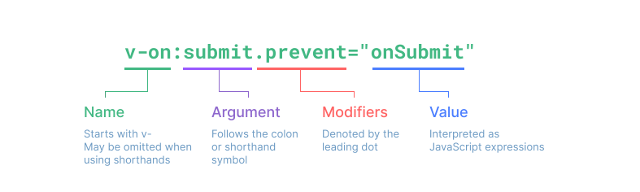
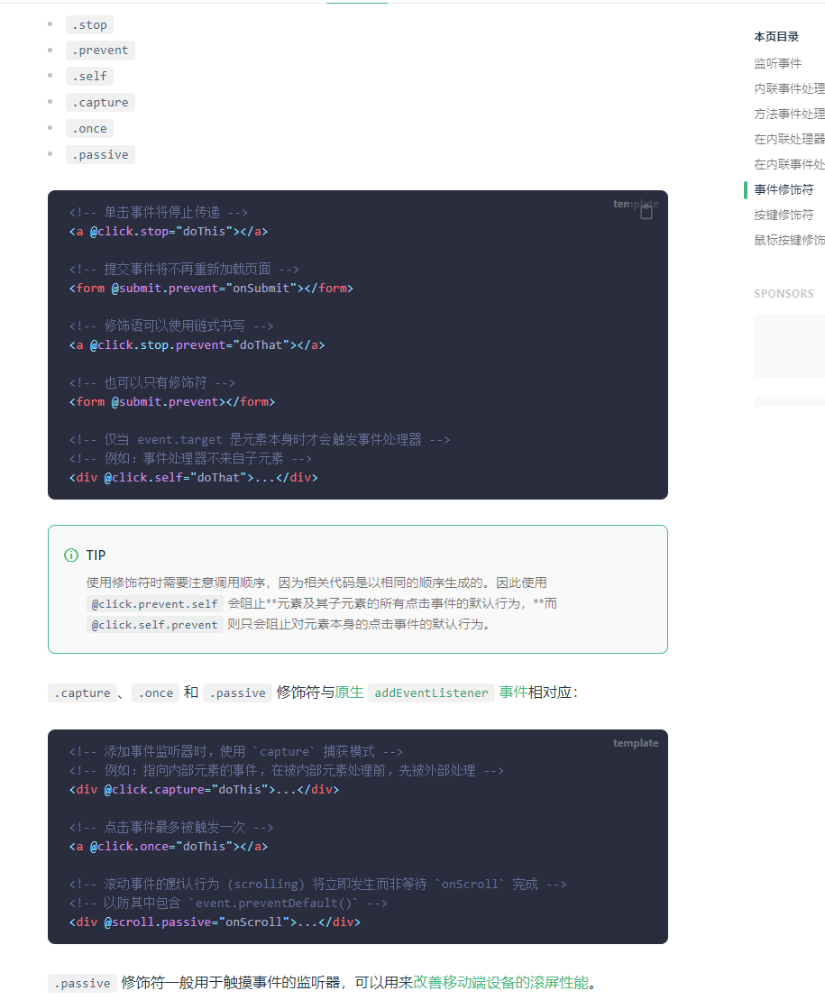
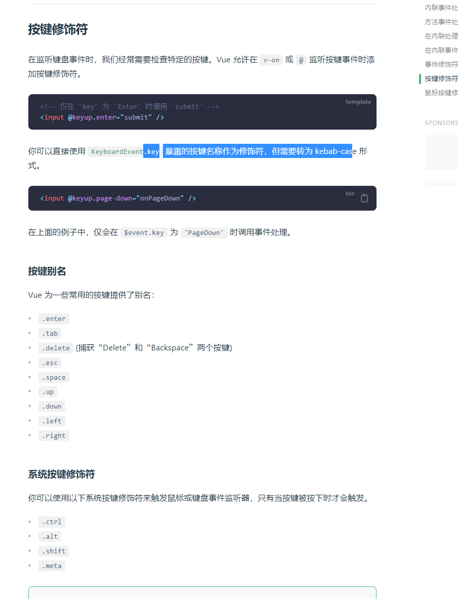
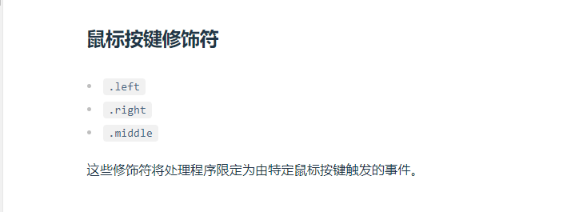

# 模板语法&#x20;

## 目录

- [v-on](#v-on)
- [示例：](#示例)

v- 开头都是vue 的指令

[v-text](https://so.csdn.net/so/search?q=v-text\&spm=1001.2101.3001.7020 "v-text") 用来显示文本

v-html 用来展示[富文本](https://so.csdn.net/so/search?q=富文本\&spm=1001.2101.3001.7020 "富文本")

v-if 用来控制元素的显示隐藏（切换真假DOM）

[v-else-if](https://so.csdn.net/so/search?q=v-else-if\&spm=1001.2101.3001.7020 "v-else-if") 表示 `v-if` 的“else if 块”。可以链式调用

v-else v-if条件收尾语句

v-show 用来控制元素的显示隐藏（display none block Css切换）

v-on 简写@ 用来给元素添加事件

v-bind 简写:  用来绑定元素的属性Attr

v-model 双向绑定

v-for 用来遍历元素

v-on修饰符 冒泡案例

v-once 性能优化只渲染一次

v-memo 性能优化会有缓存

[Vue3.2 新增 v-memo - 掘金](https://juejin.cn/post/7180973915580137527 "Vue3.2 新增 v-memo - 掘金")

## v-on

> v-on 简写@ 用来给元素添加事件









# 示例：

```typescript 
<script setup lang="ts">
import { ref } from "vue"

let msg: string = "msg"
let msgSplit: string = "我，是，瑾，语"
let num: number = 1
let msgHtml: string = "<span style='color:red'>v-html</span>"
let bindId: string = "1"
let isButtonDisabled = ref(true)
let matchBind = {
    id: "matchBindId",
    class: "matchBindClass"
}

let toTitleDate = (data: string) => {
    return data + ":test";
}

let btnClick = () => {
    isButtonDisabled.value = !isButtonDisabled.value
    console.log(isButtonDisabled)
}

let iftext: string = "a"

let forArrary: Array<string> = ["a", "b", "c"]

</script>

<template>
    <h1>模板语法</h1>
    <div>
        {{ msg }}
        <br>
        {{ num == 1 ? '我是瑾语' : '我不是瑾语' }}
        <br>
        {{ msgSplit.split("，") }}
        <br>
        <p v-html="msgHtml"></p>
        <br>
        <span v-bind:id="bindId">测试</span>
        <span :id="bindId">bind缩写测试</span>
        <br>
        <button :disabled="isButtonDisabled">{{ isButtonDisabled ? "禁用" : "启用" }}</button>
        <button v-show="!isButtonDisabled">显示show</button><br>
        <button v-on:click="btnClick">点击切换</button>
        <button @click="btnClick">点击切换缩写</button>

        <h3>bind动态绑定多个值</h3>
        <span v-bind="matchBind">bind动态绑定多个值</span>
        <h3>bind调用函数</h3>
        <span :title="toTitleDate('test')">bind动态绑定多个值</span>

        <h3>if指令</h3>
        <span v-if="iftext == 'a'">a</span>
        <span v-else-if="iftext == 'b'">b</span>
        <span v-else="iftext">c</span>

        <h3>for指令</h3>
        <div v-for="info, index in forArrary">
            <span>{{ index }}:{{ info }}</span>
        </div>


    </div>
</template>

<style>
.matchBindClass {
    color: red;
}

#matchBindId {
    font-size: small;
}
</style>
```
