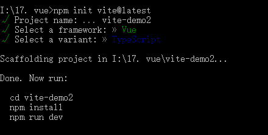
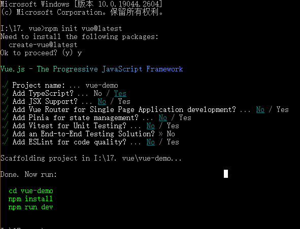

# 脚手架

## 目录

- [vue 脚手架](#vue-脚手架)
- [区别 ](#区别-)

```javascript 
// 使用vite创建项目
npm init vite@latest
4.0
// 使用vue创建项目
npm init vue@latest

// 加载依赖
npm i 

// 运行项目
npm run dev


```


vite脚手架

```javascript 
// 使用vite创建项目
npm init vite@latest
```




## vue 脚手架

```javascript 
// 使用vue创建项目
npm init vue@latest
```




# 区别&#x20;

1. 使用vite 和vue 脚手架搭建项目：vite  可以搭建多种框架的项目， vue是vue专门建立项目。
