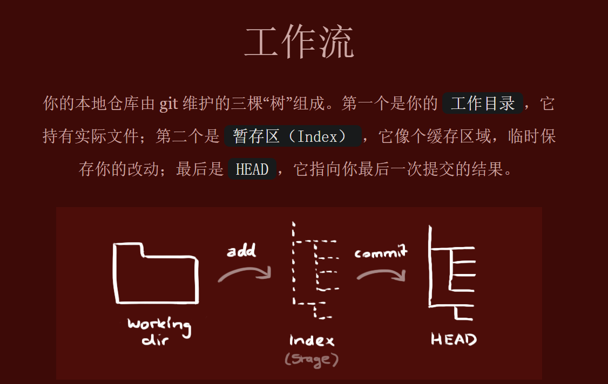
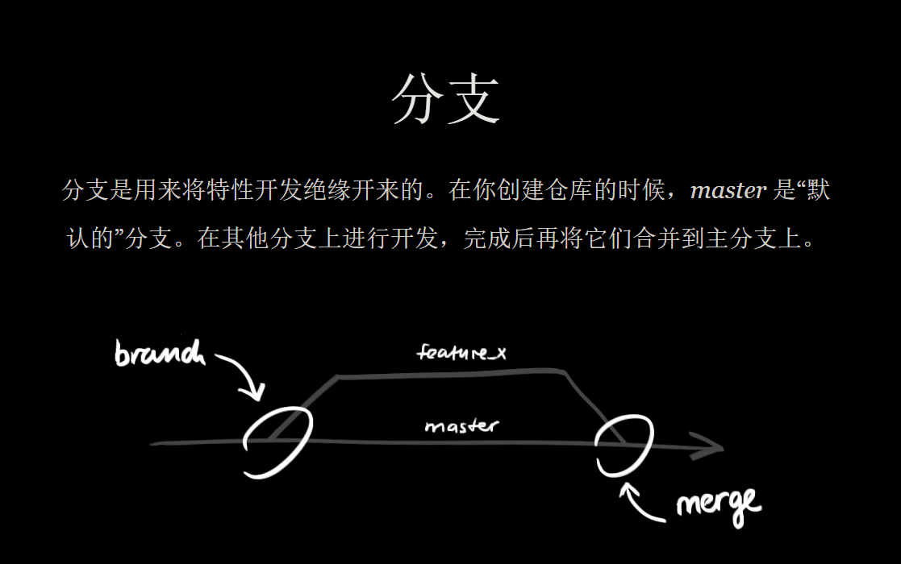

# git

## 目录

- [git 初步学习](#git-初步学习)
- [检出仓库](#检出仓库)
  - [添加和提交](#添加和提交)
  - [推送改动](#推送改动)
- [分支](#分支)
- [更新和合并 ](#更新和合并-)
  - [解决冲突](#解决冲突)
- [标签](#标签)
- [替换本地改动](#替换本地改动)
- [图形化工具](#图形化工具)
  - [git 提交规范](#git-提交规范)
    - [msg格式](#msg格式)
    - [类型](#类型)

学习地址：

[git - the simple guide - no deep shit!  http://rogerdudler.github.io/git-guide/index.zh.html](http://rogerdudler.github.io/git-guide/index.zh.html "git - the simple guide - no deep shit!  http://rogerdudler.github.io/git-guide/index.zh.html")

[ Git for Windows We bring the awesome Git VCS to Windows https://gitforwindows.org/](https://gitforwindows.org/ " Git for Windows We bring the awesome Git VCS to Windows https://gitforwindows.org/")

> 简介： git工作流： work(工作目录) =>Index(暂存区)=> head（最后一次提交结果）=> 推送到远端仓库

> work（工作目录）: 就是我们实际操作的 文件

> index（暂存区）:  可以理解成缓冲区， 临时保存我们的改动

> head : 最后一次提交结果。&#x20;



## git 初步学习

## 检出仓库

```纯文本 
git clone url filePath（路径）
```


### 添加和提交

> 把我们改动的文件提交到index去。&#x20;

```纯文本 
git add <fileName> //添加指定文件
git add * //添加所有文件
git commit -m "代码提交信息"   //提交代码到head
```


### 推送改动

> 把我们的head文件推送到远端仓储中

```纯文本 
git push origin master //master 是分支 ， 可以替换成自己的分支
```


## 分支

> 分支的作用： 分支是用来分隔我们的代码。&#x20;

> mast 是默认分支， 我们在其他的分支上开发， 完成后再将他们合并到主干上。&#x20;



```纯文本 
git checkout -b feature_x //创建feature_x 分支
git checkout master  //切回分支
git branch -d feature_x //删除分支
git push origin <branch>  //推送分支到远端仓库

```


## 更新和合并&#x20;

```纯文本 
git pull // 拉取并更新本地仓库至最新改动
git merge <branch>  //合并分支

```


### 解决冲突

> 以上更新和合并可能会出现冲突 ， 这个时候就需要我们手动解决冲突,改完后，我们需要执行

```纯文本 
git add <fileName>    //提交
git diff <source_branch> <target_branch>  //查看差异
```


## 标签

```纯文本 
git tag 1.0.0 提交id // 在提交id创建一个标签名为1.0.0
git log // 查看提交id
git push origin 标签名 //推送标签名
git tag // 列出本地标签

```


## 替换本地改动

```纯文本 
git checkout -- <filename> //丢弃work 中的改动

```


# 图形化工具

[ Sourcetree | Free Git GUI for Mac and Windows A Git GUI that offers a visual representation of your repositories. Sourcetree is a free Git client for Windows and Mac. https://www.sourcetreeapp.com/](https://www.sourcetreeapp.com/ " Sourcetree | Free Git GUI for Mac and Windows A Git GUI that offers a visual representation of your repositories. Sourcetree is a free Git client for Windows and Mac. https://www.sourcetreeapp.com/")

## git 提交规范

#### msg格式

```xml 
<类型>[可选的作用域]: <描述>

[可选的正文]

[可选的脚注]
```


#### 类型

```xml 
# 主要type
feat:     增加新功能
fix:      修复bug

# 特殊type
docs:     只改动了文档相关的内容
style:    不影响代码含义的改动，例如去掉空格、改变缩进、增删分号
build:    构造工具的或者外部依赖的改动，例如webpack，npm
refactor: 代码重构时使用
revert:   执行git revert打印的message

# 暂不使用type
test:     添加测试或者修改现有测试
perf:     提高性能的改动
ci:       与CI（持续集成服务）有关的改动
chore:    不修改src或者test的其余修改，例如构建过程或辅助工具的变动


```
