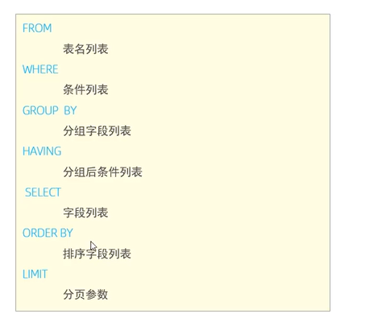

# DQL 数据库查询语言

## 目录

- [查询](#查询)
- [多表查询](#多表查询)
  - [内链接](#内链接)
  - [左链接](#左链接)
  - [右链接](#右链接)
- [联合查询](#联合查询)
  - [union ,union all](#union-union-all)
- [子查询 ](#子查询-)
- [执行顺序](#执行顺序)
- [其他](#其他)
  - [聚合函数](#聚合函数)
  - [排序](#排序)

## 查询

```sql 
# 普通查询
select 
  字段列表
from 
  表名列表
where 
  条件列表
group by 
  分组字段列表
having
  分组后条件列表
order by 
  排序字段列表
limit
  分页参数

# 普通查询
select <distinct><top> <字段>
from 表名 <别名>
Where 条件
Group By 字段
Having 条件
Order By 字段
Limit skipNum ,takeNum


# 聚合查询
select 聚合函数(字段列表) from 表名;

 
```


# 多表查询

1. 内链接
2. 左链接
3. 右链接

### 内链接

```sql 
select 字段列表 from 表1 
[inner] join 表2 on 链接条件
```


### 左链接

```sql 
select 字段列表 from 表1 
left join 表2 on 链接条件
```


### 右链接

```sql 
select 字段列表 from 表1 
right join 表2 on 链接条件
```


# 联合查询

### union ,union all

> 合并两个查询相同的 结果集， union 不会返回重复值， union all可以返回重复值。

```sql 
select 字段列表 from 表1
union [all]
select 字段列表 from 表2
```


# 子查询&#x20;

> sql语句中嵌套的select 语句，称为嵌套查询，又称子查询

```sql 
select * from t1 
where column1=(select column1 from t2);


select * from t1 
where (column1,column2)=(select column1,column1 from t2);


```


# 执行顺序



# 其他

## 聚合函数

| 函数    | 功能   |
| ----- | ---- |
| count | 统计数量 |
| max   | 最大值  |
| min   | 最小值  |
| avg   | 平均值  |
| sum   | 求和   |

## 排序

1. asc： 升序（默认）
2. desc:  降序
