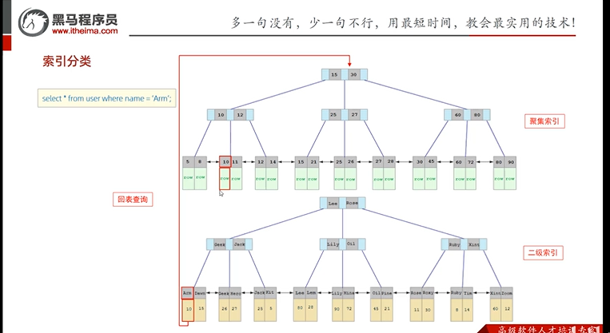

# 索引

## 目录

- [简介](#简介)
- [索引结构](#索引结构)
  - [二叉树](#二叉树)
  - [b-tree （多路平衡查询树）](#b-tree-多路平衡查询树)
  - [b+tree (msyql 默认)](#btree-msyql-默认)
  - [hash](#hash)
- [索引分类](#索引分类)
- [索引使用](#索引使用)
- [优缺点](#优缺点)
  - [优势： ](#优势-)
  - [缺点：](#缺点)
- [索引设计原则](#索引设计原则)

# 简介

1. 索引结构
2. 索引分类
3. 索引语法
4. sql性能分析
5. 索引使用
6. 索引设计原则

# 索引结构

## 二叉树

## b-tree （多路平衡查询树）

## b+tree (msyql 默认)

> 层级少， 效率高

## hash

# 索引分类

| 分类   | 含义                              | 特点         |
| ---- | ------------------------------- | ---------- |
| 聚焦索引 | 将数据存储与索引放一块，索引结构的叶子节点保存了行数据     | 必须有，并且只有一个 |
| 二级索引 | 将数据存储与索引分开存储，索引结构的叶子节点关联的是对应的主键 | 可以存多个      |



# 索引使用

```sql 
# 创建索引
create [unique| FULLTEXT ] index 索引名称 
on 表名(表字段,....);

# 创建前缀索引
create index idx_xxx_xxx on 表名(表字段(长度))

# 查看索引
show index from 表名;

# 删除索引
drop index 索引名称 on 表名;

```


示例

```sql 
# 查看所有
show index from emp;

# 创建普通索引
create index idx_emp_name on emp(name);

# 创建唯一索引
create unique index idx_emp_card on emp(id_card);

# 创建联合索引
create index idx_emp_name_age_gender on emp(name,age,gender);

```


# 优缺点

## 优势：&#x20;

1. 提高索引检索效率 ，降低数据库io成本
2. 通过对索引进行排序，降低排序的成本，降低cpu的消耗&#x20;

## 缺点：

1. 索引列占用空间
2. 降低了增删改的效率

# 索引设计原则

1. 针对于数据量较大，且查询比较频繁的表建立索引。
2. 针对于常作为查询条件 (where)、排序 (order by)、分组 (group by) 操作的字段建立索引。
3. 尽量选择区分度高的列作为索引，尽量建立唯一索引，区分度越高，使用索引的效率越高。
4. 如果是字符串类型的字段，字段的长度较长，可以针对于字段的特点，建立前缀索引
5. 尽量使用联合索引，减少单列索引，查询时，联合索引很多时候可以覆盖索引，节省存储空间，避免回表，提高查询效率
6. 要控制索引的数量，索引并不是多多益善，索引越多，维护索引结构的代价也就越大，会影响增制改的效率
7. 如果索引列不能存储NULL值，请在创建表时使用NOT NULL约束它。当优化器知道每列是否包含NULL值时，它可以更好地确定哪个索引最有效地用于查询。
