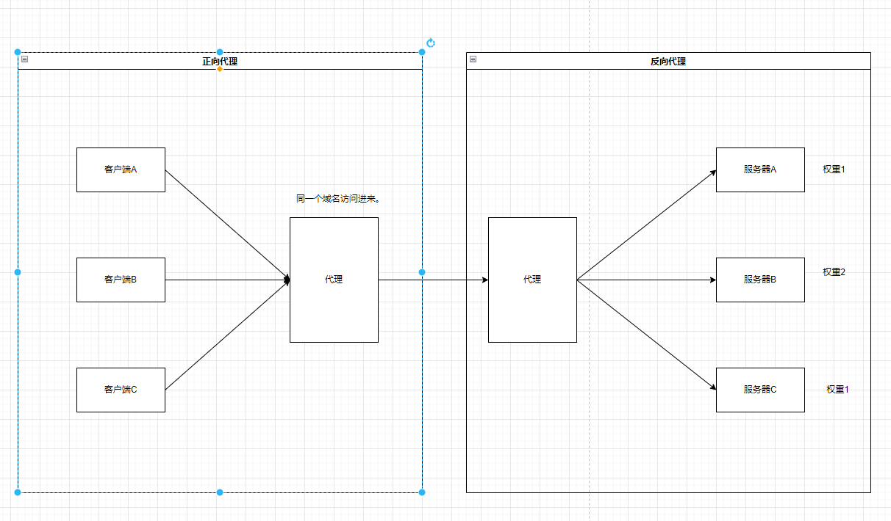
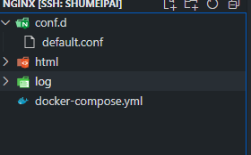

# nginx

## 目录

- [简介](#简介)
- [核心文件路径](#核心文件路径)
- [关键字](#关键字)
- [安装](#安装)
  - [windows](#windows)
  - [liunx](#liunx)
  - [docker](#docker)
- [命令](#命令)
- [配置文件结构](#配置文件结构)
- [负载均衡策略](#负载均衡策略)
  - [轮询](#轮询)
  - [加权轮询](#加权轮询)
  - [最少链接](#最少链接)
  - [加权最少链接](#加权最少链接)
  - [ip\_hash ](#ip_hash-)
  - [普通hash](#普通hash)
- [应用](#应用)
  - [静态站点](#静态站点)
  - [文件服务器](#文件服务器)
- [vscode 配置](#vscode-配置)

## 简介

> nginx \[engine x] 是一个 HTTP 和反向代理服务器， 邮件代理服务器， 和一个通用的 TCP/UDP 代理服务器， 最初由[伊戈尔·西索耶夫](http://sysoev.ru/en/ "伊戈尔·西索耶夫")撰写。

1. 基本的 HTTP 服务器功能
2. 其他http服务器功能
3. 邮件代理服务器功能
4. TCP/UDP代理服务器功能
5. 体系结构和可伸缩性

## 核心文件路径

```bash 
# 配置文件存放目录
/etc/nginx

# 主配置文件
/etc/nginx/conf.d

# 程序默认存放位置
/usr/share/nginx/html

# 日志默认位置
/var/log/nginx


```


[ nginx  https://nginx.org/en/](https://nginx.org/en/ " nginx  https://nginx.org/en/")

## 关键字

> 正向代理， 反向代理，&#x20;

> 负载均衡： 轮询，加权轮重，ip hash

> 动静分离



## 安装

[ nginx: download  https://nginx.org/en/download.html](https://nginx.org/en/download.html " nginx: download  https://nginx.org/en/download.html")

### windows

[nginx-1.22.1.zip](file/nginx-1.22.1_eQuAS-xpN-.zip "nginx-1.22.1.zip")

### liunx

### docker



```nginx 
# ./conf.d 文件夹下创建default.conf

server {
    listen       80;
    listen  [::]:80;
    server_name  localhost;

    location / {
        root   /usr/share/nginx/html;
        index  index.html index.htm;
    }

  
    error_page   500 502 503 504  /50x.html;
    location = /50x.html {
        root   /usr/share/nginx/html;
    }
}


```


```yaml 
version: '3'

services:
  myNginx:
    image: nginx:latest
    volumes:
      - ./conf.d:/etc/nginx/conf.d
      - ./html:/usr/share/nginx/html
      - ./log:/var/log/nginx
    container_name: myNginx
    ports:
      - 80:80
    restart: always

```


## 命令

```batch 
nginx               启动
nginx -s stop       快速关闭Nginx，可能不保存相关信息，并迅速终止web服务。
nginx -s quit       平稳关闭Nginx，保存相关信息，有安排的结束web服务。
nginx -s reload     因改变了Nginx相关配置，需要重新加载配置而重载。
nginx -s reopen     重新打开日志文件。
nginx -c filename   为 Nginx 指定一个配置文件，来代替缺省的。
nginx -t            不运行，仅仅测试配置文件。nginx 将检查配置文件的语法的正确性，并尝试打开配置文件中所引用到的文件。
nginx -v            显示 nginx 的版本。
nginx -V            显示 nginx 的版本，编译器版本和配置参数。
```


## 配置文件结构

```nginx 
全局配置

events {
    worker_connections  1024;
}

http {
  http 配置
  
  upstream xx{
    server ip weight=1(权重);
    //负载均衡 ： 服务器资源
  }
  
  server {
        listen       8080;
        server_name  localhost;
        //代理
        location / {
            root   html;
            index  index.html index.htm;
            proxy_pass  协议+xx;
        }
  }

  server {
        listen       8080;
        server_name  localhost;
        //代理
        location / {
            root   html;
            index  index.html index.htm;
            proxy_pass  协议+xx;
        }
  }
}

```


示例

```nginx 
#运行用户
#user  nobody;

#启动进程,通常设置成和cpu的数量相等
worker_processes  1;

#启动进程,通常设置成和cpu的数量相等
#error_log  logs/error.log;
#error_log  logs/error.log  notice;
#error_log  logs/error.log  info;

#PID文件，记录当前启动的nginx的进程ID
#pid        logs/nginx.pid;

#工作模式及连接数上限
events {
    worker_connections  1024;#单个后台worker process进程的最大并发链接数
}

#设定http服务器，利用它的反向代理功能提供负载均衡支持
http {
    #设定mime类型(邮件支持类型),类型由mime.types文件定义
    include       mime.types;
    default_type  application/octet-stream;

    #设定日志
    #log_format  main  '$remote_addr - $remote_user [$time_local] "$request" '
    #                  '$status $body_bytes_sent "$http_referer" '
    #                  '"$http_user_agent" "$http_x_forwarded_for"';

    #access_log  logs/access.log  main;

    #sendfile 指令指定 nginx 是否调用 sendfile 函数（zero copy 方式）来输出文件，对于普通应用，
    #必须设为 on,如果用来进行下载等应用磁盘IO重负载应用，可设置为 off，以平衡磁盘与网络I/O处理速度，降低系统的uptime.
    sendfile        on;
    #tcp_nopush     on;

    #连接超时时间
    #keepalive_timeout  0;
    keepalive_timeout  65;
  
    #gzip压缩开关
    #gzip  on;

   #设定实际的服务器列表
    upstream test{
        #weigth参数表示权值，权值越高被分配到的几率越大
        server  127.0.0.1:8080 weight=1;
        server  127.0.0.1:8081 weight=1;
    }

    #HTTP服务器
    server {
        #监听80端口，80端口是知名端口号，用于HTTP协议
        listen       80;

        #定义使用www.xx.com访问
        server_name  localhost;

        #charset koi8-r;

        #access_log  logs/host.access.log  main;

        location / {
            #指向webapp的目录
            #root的处理结果是：root路径＋location路径
            #alias的处理结果是：使用alias路径替换location路径
            root   html;
            alias  html;
            #首页
            index  index.html index.htm;
            #反向代理的路径（和upstream绑定），location 后面设置映射的路径
            proxy_pass  http://test;
        }

        #error_page  404              /404.html;

        # redirect server error pages to the static page /50x.html
        #
        error_page   500 502 503 504  /50x.html;
        location = /50x.html {
            root   html;
        }

        # proxy the PHP scripts to Apache listening on 127.0.0.1:80
        #
        #location ~ \.php$ {
        #    proxy_pass   http://127.0.0.1;
        #}

        # pass the PHP scripts to FastCGI server listening on 127.0.0.1:9000
        #
        #location ~ \.php$ {
        #    root           html;
        #    fastcgi_pass   127.0.0.1:9000;
        #    fastcgi_index  index.php;
        #    fastcgi_param  SCRIPT_FILENAME  /scripts$fastcgi_script_name;
        #    include        fastcgi_params;
        #}

 #禁止访问 .htxxx 文件
        # deny access to .htaccess files, if Apache's document root
        # concurs with nginx's one
        #
        #location ~ /\.ht {
        #    deny  all;
        #}
    }


    # another virtual host using mix of IP-, name-, and port-based configuration
    #
    #server {
    #    listen       8000;
    #    listen       somename:8080;
    #    server_name  somename  alias  another.alias;

    #    location / {
    #        root   html;
    #        index  index.html index.htm;
    #    }
    #}


    # HTTPS server
    #
    #server {
    #    listen       443 ssl;
    #    server_name  localhost;

    #    ssl_certificate      cert.pem;
    #    ssl_certificate_key  cert.key;

    #    ssl_session_cache    shared:SSL:1m;
    #    ssl_session_timeout  5m;

    #    ssl_ciphers  HIGH:!aNULL:!MD5;
    #    ssl_prefer_server_ciphers  on;

    #    location / {
    #        root   html;
    #        index  index.html index.htm;
    #    }
    #}

}


```


## 负载均衡策略

1. 轮询
2. 加权轮询
3. 最少链接
4. 加权最少链接
5. ip hash&#x20;
6. 普通hash&#x20;

### 轮询

```nginx 
upstream bck_testing_01 {
  # 默认所有服务器权重为 1
  server 192.168.250.220:8080
  server 192.168.250.221:8080
  server 192.168.250.222:8080
}
```


### 加权轮询

```nginx 
upstream bck_testing_01 {
  server 192.168.250.220:8080   weight=3
  server 192.168.250.221:8080              # default weight=1
  server 192.168.250.222:8080              # default weight=1
}
```


### 最少链接

> 分配给最少链接的服务器&#x20;

```nginx 
upstream bck_testing_01 {
  least_conn;

  # with default weight for all (weight=1)
  server 192.168.250.220:8080
  server 192.168.250.221:8080
  server 192.168.250.222:8080
}
```


### 加权最少链接

```nginx 
upstream bck_testing_01 {
  least_conn;

  server 192.168.250.220:8080   weight=3
  server 192.168.250.221:8080              # default weight=1
  server 192.168.250.222:8080              # default weight=1
}
```


### ip\_hash&#x20;

```nginx 
upstream bck_testing_01 {

  ip_hash;

  # with default weight for all (weight=1)
  server 192.168.250.220:8080
  server 192.168.250.221:8080
  server 192.168.250.222:8080

}
```


### 普通hash

```nginx 
upstream bck_testing_01 {

  hash $request_uri;

  # with default weight for all (weight=1)
  server 192.168.250.220:8080
  server 192.168.250.221:8080
  server 192.168.250.222:8080

}
```


## 应用

1. 多个webapp配置
2. 静态站点
3. 文件服务器

### 静态站点

> &#x20;html 文件和一堆静态资源

```nginx 
  server {
        listen       8090;
        server_name  localhost;
     
        location / {
            root   C:/Users/24514/Desktop/nginx/html;
            index  home.html home.htm;
        }
   
        error_page   500 502 503 504  /50x.html;
        location = /50x.html {
            root   html;
        }

    }

```


### 文件服务器

Nginx 中的配置要点：

- 将 autoindex 开启可以显示目录，默认不开启。
- 将 autoindex\_exact\_size 开启可以显示文件的大小。
- 将 autoindex\_localtime 开启可以显示文件的修改时间。
- root 用来设置开放为文件服务的根路径。
- charset 设置为 `charset utf-8,gbk;`，可以避免中文乱码问题（windows 服务器下设置后，依然乱码，本人暂时没有找到解决方法）。

```nginx 
autoindex on;# 显示目录
autoindex_exact_size on;# 显示文件大小
autoindex_localtime on;# 显示文件时间

server {
    charset      utf-8,gbk; # windows 服务器下设置后，依然乱码，暂时无解
    listen       9050 default_server;
    listen       [::]:9050 default_server;
    server_name  _;
    root         /share/fs;
}
```


## vscode 配置

[nginx获取用户真实ip ](nginx获取用户真实ip-/nginx获取用户真实ip-.md "nginx获取用户真实ip ")

[高级nginx](高级nginx/高级nginx.md "高级nginx")
